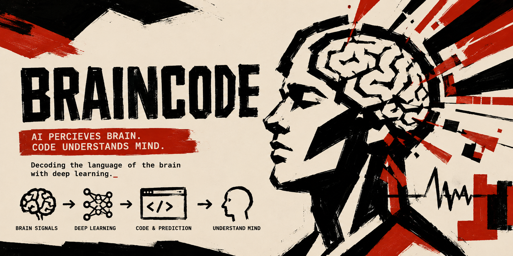

# Braincode


A multi-model coding workflow engine.

Braincode turns one coding request into a coordinated engineering workflow:

```text
planner -> specialist workers -> primary executor -> reviewer -> final report
```

It is not another AI CLI that asks one model to plan, code, and review itself. Braincode turns one prompt into a routed, review-gated, auditable patch with role separation, model routing, isolated worker contexts, and structured final reports.

**Languages**: [English](./README.md) · [中文](./README.zh.md) · [Français](./README.fr.md)



## Quickstart

```sh
npm i -g @taotao7/braincode
braincode config
braincode run --dry-run "review this repo"
```

`braincode config` opens the local configuration UI and stores user settings under `~/.braincode/`. The dry run asks routeBrain for the same routing plan used by real execution, but does not edit files or run tools.

### First Real Edit

```sh
braincode run --allow-edits "update README wording"
```

`--allow-edits` auto-approves first-party local reads and file edits. Command execution, MCP tools, unknown tools, and permission-policy deny matches remain blocked.

### Full Autonomous Local Run

```sh
braincode run --yes "fix failing test and run checks"
```

`--yes` auto-approves local tool calls that are not denied by policy. Use it when you want Braincode to patch, run checks, invoke the review gate, and return a structured final report without stopping for terminal approval prompts.

## Why Braincode?

Most coding agents ask one model to plan, code, and review itself. Braincode separates these roles.

- Route simple tasks to cheap models
- Escalate risky work to stronger models
- Keep worker contexts isolated
- Require independent review for risky file edits
- Produce structured final reports

## Common Commands

```bash
braincode run "add login validation"
braincode run --allow-edits "add login validation"
braincode run --yes "fix the failing test"
braincode run --dry-run "add login validation"
braincode run --dry-run --heuristic "add login validation"
braincode benchmark
```

`braincode run` uses the configured Brain Model. Non-interactive runs are read-only by default because there is no approval UI; use `--allow-edits` to auto-approve first-party local reads and file edits while blocking command execution, MCP tools, and unknown tools, or `--yes` to auto-approve tool calls that are not denied by policy. `--dry-run` previews the same routeBrain planning path used by real execution; add `--heuristic` only when you need a no-provider fallback diagnostic. Use `braincode config` to change the active Brain Model and provider/model settings.

`braincode benchmark` runs a deterministic demo suite of representative coding prompts: README edits, failing-test fixes, auth-risk changes, package/script changes, and security-review-only runs. By default it asks routeBrain when credentials are available and labels heuristic fallback checks; use `--heuristic` for a no-provider diagnostic run.

## Safe Review Patch Demo

The runnable demo at [examples/login-validation-demo](./examples/login-validation-demo) shows the core loop on a small TS/Bun/React fixture:

```text
routeBrain -> frontend/backend/qa -> primary -> checks -> review -> final report
```

Run the offline smoke test from the repository root:

```sh
bun run braincode -- benchmark --execute --task login-validation
```

Expected report shape:

```text
login-validation       PASSED changed=src/login.ts +5 -1 checks=passed review=approved
```

For a full provider-backed run, see the demo prompt, expected patch, and asciinema transcript in [examples/login-validation-demo](./examples/login-validation-demo).

## How It Works

1. `routeBrain` creates a structured plan.
2. Brain spawns isolated specialist workers.
3. Workers return structured results, not full transcripts.
4. The primary executor applies the change with worker context.
5. A review worker checks the result when policy requires review.
6. Brain returns a final report and records the session.

## Install

```bash
# Homebrew (macOS / Linux)
brew install taotao7/tap/braincode

# npm (requires Node >= 18)
npm i -g @taotao7/braincode

# Or download a prebuilt binary
curl -L https://github.com/taotao7/braincode/releases/latest/download/braincode-darwin-arm64.tar.gz \
  | tar -xz && ./braincode-darwin-arm64 help
```

Supported targets: `darwin-arm64`, `darwin-x64`, `linux-x64`, `linux-arm64`. After install, run `braincode` for the TUI or `braincode config` to open the local configuration page.

## Common Error Paths

| Symptom | Fix |
| --- | --- |
| Missing API key | Run `braincode config`, or add the provider key to `~/.braincode/auth.json`. |
| Image input requires vision model | Choose a vision-capable routeBrain/primary model in `braincode config`. |
| Empty assistant response | Set `BRAINCODE_DEBUG=true` and verify the model API type in `~/.braincode/models.json`. |
| Context handoff required | Retry with a narrower task or include exact `@file` references so workers receive smaller context. |
| Command blocked by permission mode | Use the TUI for approval, use `--yes` for non-denied commands, or update `tools.json`; deny rules cannot be bypassed. |

## Release Notes

See [RELEASES.md](./RELEASES.md).

## Current Status

- Bun monorepo with `apps/*` and `packages/*` workspaces.
- CLI entrypoints for `braincode`, `braincode run`, `braincode run --dry-run`, and `braincode config`.
- Braincode-owned Ink TUI with slash commands, sessions, handoff, MCP/hook/brain/intent panels, streaming text, thinking, todo updates, worker lifecycle, `Ctrl+T` transcript folding, a live elapsed/token status line, footer BrainPet progress, and tool approval decisions.
- Browser config service backed by `~/.braincode/` for settings, execution mode, brains, models, tools, auth status, authenticated subscription model selection, and usage statistics.
- Brain preset inheritance via `extends`, so small Brain Model presets can override only the differing planner, role, routing, or context fields.
- Runtime plans with mode, Brain Model, routed primary role, todos, dependencies, workers, routing metadata, selected model, and tool execution mode.
- `routeBrain` LLM routing during execution and plan previews, with deterministic heuristic routing available for diagnostics and fallback.
- Isolated support workers, primary executor, and policy-triggered review worker using structured handoff/result packets.
- Read-only project tools for `librarian`, `qa`, `security`, and `review` workers, so support agents can inspect files, search code, read diffs, and report evidence without edit/execute capability.
- Session JSONL persistence for runs, todo events, worker lifecycle, hooks, prompt references, handoff, summaries, and errors.
- Project support discovery for `AGENTS.md`, `.mcp.json`, `.braincode/checks.json`, `.agents/skills`, and `.agents/hooks.json`.
- MCP stdio bridge that connects project/user MCP servers and exposes listed tools to the agent runtime.
- First-party local coding tools for zero-config file listing, file reads, content/path search, file edits, patch application, shell commands, long-running exec sessions with stdin polling, git diffs, changed-file inspection, and package scripts.
- Non-interactive run permission modes: read-only default, `--allow-edits` for local read/file-edit approval, and `--yes` for full auto-approval.
- Tool-call evidence cache for repeated deterministic read-only local tool calls, with duplicate reminders plus cached-entry and duplicate-counter invalidation after write/execute tools.
- Tool approval UI for risky write/execute tool calls, with tool-level allow/confirm policy plus path-aware and command-aware permission rules from `tools.json`.
- Permission Policy v2: sensitive paths such as `src/auth/**`, `db/**`, `package.json`, and `.github/workflows/**` ask and force review, while commands such as `git push`, package publish commands, and `rm -rf` are denied before execution.
- Minimal patch ledger: successful runs collect changed files and git diff stats and append a `patch_summary` session record.
- Automated patch checks: file-changing runs classify the patch kind, select `check`, `typecheck`, `lint`, and `test` package scripts according to smart policy, run them with the detected JS package manager (`bun`, `pnpm`, `yarn`, or `npm`), append `check_summary`, and pass patch/check artifacts to review workers.
- Check runner policy in `tools.json` plus project `.braincode/checks.json`: checks can be disabled, pinned to explicit package scripts, customized per patch kind, and bounded by timeout/output limits.
- Typed review decisions: review workers return `approved`, `changes_requested`, or `blocked` with severity-ranked findings, file/line evidence, required changes, blocking issues, and residual risks; the runtime appends `review_decision` and prevents failed checks from being reported as approved.
- Prompt references for `@file`, compact `@@session` context, and image attachments.
- Router-plan UX: `/plan` asks the configured `routeBrain` by default, heuristic diagnostics are explicit, and the TUI shows routing source, confidence, and reason in plan and intent views.
- Demo benchmark CLI for representative coding tasks covering docs edits, failing tests, auth-risk implementation, package/script changes, and security-review-only prompts.
- Login validation safe-review demo with a TS/Bun/React fixture, expected patch, focused check policy, and asciinema transcript under `examples/login-validation-demo`.

## Remaining Work

- Continue focused tests for routing, context isolation, hooks, tools, permissions, review gates, and failure recovery.

## Brain Models and Roles

A **Brain Model** is a routing policy, not a single LLM. It decides which model, role, tool budget, and context budget each part of a task should get.

Braincode has two top-level modes:

- `auto` - the main mode, automatically plans by intent and routes work to different agents/models.
- `radical` - a more aggressive autonomous mode for users who want faster, broader execution. In the TUI it exposes the default local tools and auto-approves tool calls, even when user-level local tool toggles are disabled.

The runtime exposes **14 roles**:

**Router**
- `routeBrain` - LLM-driven planner. Reads the prompt and emits a structured routing decision.

**Domain specialists**
- `frontend` · `backend` · `dba` · `devops` · `designer` · `security` · `qa` · `rush`

**Function helpers**
- `librarian` - codebase mapping and external fact-finding
- `review` - defect inspection of existing code or generated changes
- `oracle` - hard reasoning and architecture tradeoffs
- `summarize` - handoff compression

**Status display**
- `pet` - read-only BrainPet status reporter

Removed in v0.2.0: `coding`, `fastReply`, `research`. Existing user configs are migrated automatically.

## Implementation Notes

Braincode is a Bun-based monorepo, but that is an implementation detail rather than the product pitch. Product orchestration lives in Braincode packages; app entrypoints stay thin.

The project reuses Pi infrastructure where it makes sense, while keeping Braincode's product-specific orchestration and UI separate. The interactive terminal UI is Braincode-owned and built with Ink; Pi remains a provider/runtime layer, not the product interface.

Runtime user configuration belongs under `~/.braincode/`, not inside the repository. Secrets belong in `~/.braincode/auth.json` or a future secure credential store.

## Documentation

- [Overview](./docs/overview.md) - high-level map of layers, packages, and end-to-end request flow. Start here.
- [Architecture](./docs/architecture.md) - main system architecture, Brain Model design, context isolation, Pi integration, local config service.
- [Context management](./docs/context-management.md) - Brain/worker isolation, handoff/result packets, prompt references, session JSONL.
- [Agent communication](./docs/agent-communication.md) - worker lifecycle, routing, hooks, runtime events, multi-agent runs.
- [Project structure and plan](./docs/project-structure.md) - goals, non-goals, workspace layout, package responsibilities, implementation status.
- [Visual style](./docs/visual-style.md) - Brutalist technical poster direction for UI and brand surfaces.
- [References](./docs/references.md) - Amp and Pi reference material used for design decisions.

## Development Commands

```sh
bun install
bun run check
bun test
bun run coverage
bun run braincode -- help
bun run braincode
bun run config
bun run braincode -- config --port 14581
bun run braincode -- run --dry-run "review this patch"
bun run braincode -- run --dry-run --heuristic "review this patch"
bun run braincode -- run "hello"
bun run braincode -- run --allow-edits "update README wording"
bun run braincode -- run --yes "fix a failing test and run checks"
BRAINCODE_DEBUG=true bun run braincode -- run "hello"
bun run benchmark
bun run benchmark -- --heuristic
bun run braincode -- benchmark --task auth-risk-change --json
```

The `config` command starts the local browser configuration service and creates missing files under `~/.braincode/`.
Real `run` and TUI prompts require a provider key in `~/.braincode/auth.json`, for example `providers.anthropic.apiKey` for the default model.
Inside the TUI, use `/help` for commands and `/plan <task>` to preview the configured `routeBrain` decision. If the router is unavailable, the plan falls back to the heuristic route and labels that source. Use `/plan --heuristic <task>` only for no-provider diagnostics. The TUI intentionally has no direct model-switching command.

Set `BRAINCODE_DEBUG=true` to write redacted runtime diagnostics to stderr: model candidate selection, provider payload/response summaries, non-streaming agent event summaries, fallback attempts, and empty assistant responses. In the TUI, debug output is written to `~/.braincode/debug.log` by default so it does not corrupt the Ink screen. High-frequency text/thinking delta event logs are skipped unless `BRAINCODE_DEBUG_STREAM=true` is also set. Secrets are redacted before logging.
